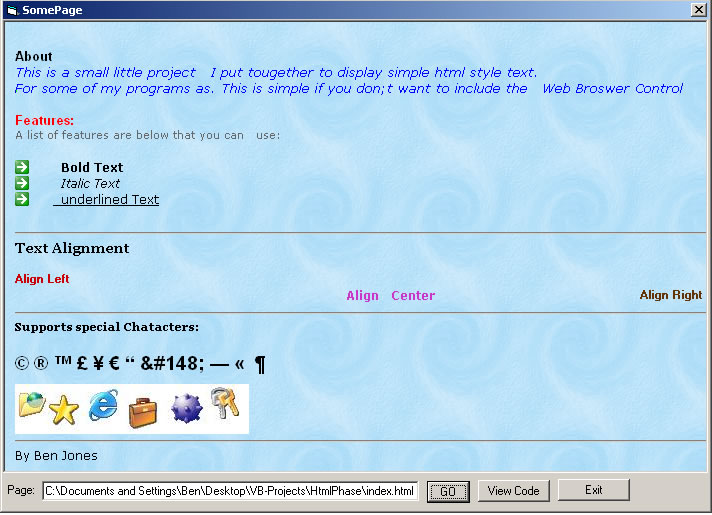



## HTML Viewer

### Description

Hi Fellow Programmers. This is a small example I made to view Basic HTML text. I was board so I desided to make it Only took 30 min to make.

Anyway supports Bold, Italic, Underline, Images, Text Colors, Text Sizes, Hoz Lines you can have a picture background or a color background Also Added a Refresh to go to a different page.

Anyway Got fed up after a while and desided to stop working on it hope you find it of some use.
 
### More Info
 

             |
---                |---
**Submitted On**   |2001-09-09 20:01:14
**By**             |[dreamvb](https://github.com/Planet-Source-Code/PSCIndex/blob/master/ByAuthor/dreamvb.md)
**Level**          |Intermediate
**User Rating**    |5.0 (25 globes from 5 users)
**Compatibility**  |VB 3\.0, VB 4\.0 \(32\-bit\), VB 5\.0, VB 6\.0
**Category**       |[Coding Standards](https://github.com/Planet-Source-Code/PSCIndex/blob/master/ByCategory/coding-standards__1-43.md)
**World**          |[Visual Basic](https://github.com/Planet-Source-Code/PSCIndex/blob/master/ByWorld/visual-basic.md)
**Archive File**   |[HTML\_Viewe1791769102004\.zip](https://github.com/Planet-Source-Code/dreamvb-html-viewer__1-56104/archive/master.zip)

